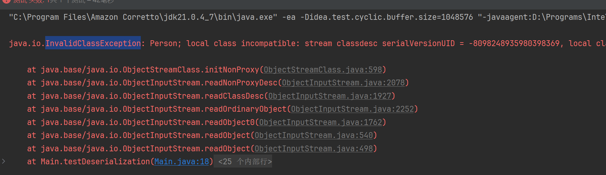
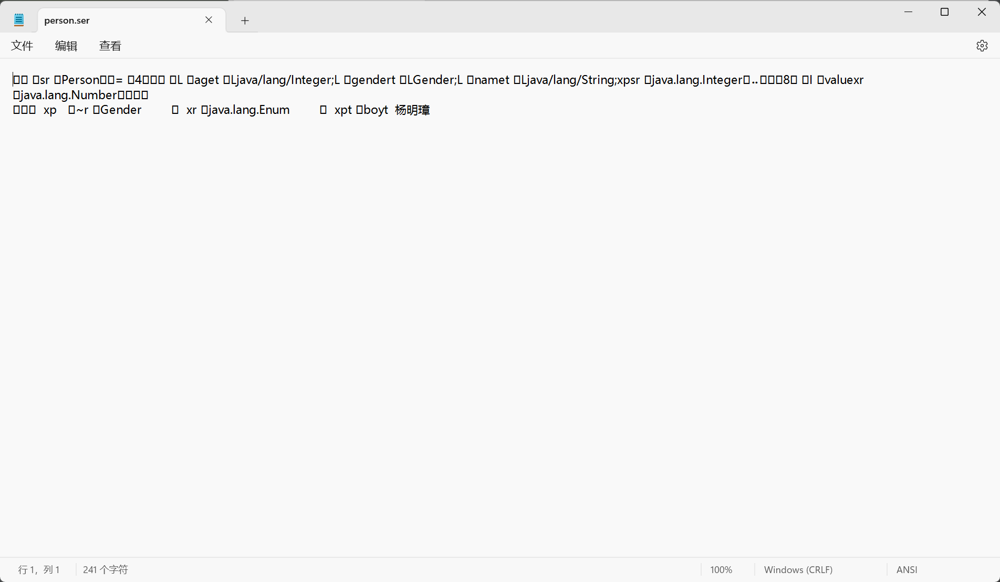
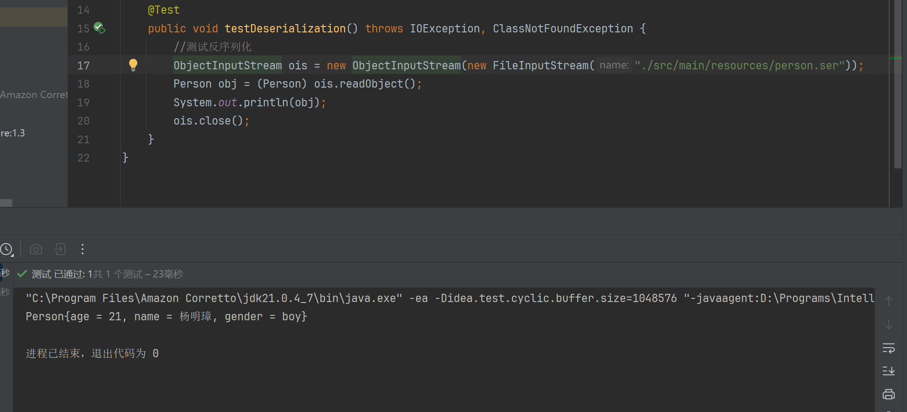
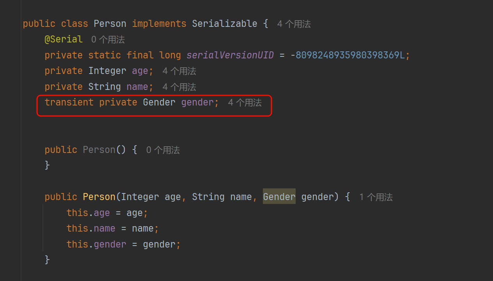
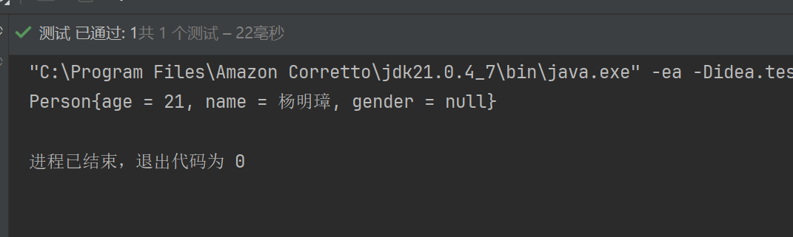

> 软工2203 2200770165 杨明璋
>
> 项目仓库地址：[Ymz114514 (Ymz114514) / Repositories · GitHub](https://github.com/Ymz114514?tab=repositories)

# 一、会话安全性

## 1.会话劫持和防御

### 1.1会话劫持

攻击者通过窃取用户的会话 ID，就可以冒充合法用户访问受保护的资源。例如，在一个不安全的网络环境中（如公共 Wi - Fi），攻击者可以使用网络嗅探工具来捕获包含会话 ID 的网络数据包。**如果会话 ID 是以明文形式在 Cookie 中传输的，那么攻击者就很容易获取它。**

### 1.2如何防御

- **传输安全。**用 HTTPS 传输，设 Cookie 为 HttpOnly。
- **ID 生成。**用 CSPRNG 生成足够长且随机的 ID。
- **更新 ID。**敏感操作或定期更新。
- **身份验证与授权。**采用 MFA，严格检查权限。
- **数据加密。**加密服务器端 Session 数据。

## 2.跨站脚本攻击（XSS）和防御

### 2.1XSS定义

攻击者通过**在目标网站中注入恶意脚本**（通常是 JavaScript，但也可能是其他客户端脚本语言，如 VBScript），当用户访问被注入恶意脚本的页面时，浏览器会执行这些脚本，从而导致用户信息泄露、用户操作被劫持等安全问题。

### 2.2如何防御

- **输入验证**：严格验证用户输入数据，限制输入类型和长度，过滤特殊字符。
- **输出编码**：将数据输出到 HTML 页面时进行编码，避免特殊字符被当作脚本执行。
- **设置 CSP**：通过设置 Content - Security - Policy 头信息，限制脚本来源。
- **设置 HttpOnly Cookie**：防止 JavaScript 访问包含敏感信息的 Cookie。

## 3.跨站请求伪造（CSRF）和防御

### 3.1CSRF定义

攻击者利用用户在被信任网站已经登录的状态，通过欺骗用户访问恶意网站，让用户浏览器在用户不知情的情况下，向被信任的网站发送请求，执行一些非用户本意的操作，比如修改用户密码、进行资金转账等。

### 3.2如何防御

- **使用 CSRF 令牌**：服务器生成令牌放在表单或请求头，验证请求中的令牌是否匹配来判断合法性。
- **检查请求来源**：查看 Referer 或 Origin 头信息，和合法源对比，不过该方法有局限。
- **设置 Same - Site Cookie 属性**：通过设置为 Strict 等属性来控制 Cookie 的发送，防止 CSRF 攻击。


# 二、分布式会话管理

## 1.分布式环境下的会话同步问题

在分布式环境下，由于应用部署在多个相互独立的服务器上，用户会话信息存储在单台服务器内存的传统方式会出现问题。当用户请求在不同服务器间切换时，新的服务器可能没有该用户的会话信息，导致用户体验变差，比如像需要重新登录这种情况。而且，**网络延迟和服务器故障等因素还会使会话数据更新后无法及时同步，进而造成数据不一致**，例如购物车信息修改后在其他服务器上无法同步更新，就会引发业务错误。

## 2.Session集群解决方案

### 2.1粘性会话

这种方案的工作方式是通过负载均衡器，根据用户的特定标识（如 IP 地址），将用户的请求固定发送到之前处理过该用户请求的同一台服务器。这样**只要用户一直和同一台服务器交互，就能够正常使用会话。**其优点是**实现相对简单**，能在一定程度上解决会话问题。缺点是如果该服务器出现故障，用户的会话可能丢失，并且可能导致服务器负载不均衡，**不能充分利用集群的所有资源**。

### 2.2会话复制

**当集群中的一台服务器上的会话数据发生变化时，会将这些数据复制到其他服务器。**这样无论用户的下一个请求被路由到哪台服务器，都可以获取到会话信息。其优点是**能保证各服务器都有完整的会话数据**。缺点是会**消耗大量的网络带宽和服务器资源**，因为会话数据量可能较大，频繁复制会对系统性能产生较大影响，而且随着集群规模扩大，复制的复杂性和成本都会显著增加。

### 2.3使用共享存储

这种方案的原理是**将会话数据存储在共享的存储设备中**，如数据库或者分布式文件系统。服务器在需要时可以从共享存储中获取会话信息。其优点是**数据集中存储，比较可靠**，多台服务器可以方便地访问。缺点是**共享存储的性能可能成为瓶颈**，并且对存储设备的可靠性和稳定性要求较高。

### 2.4使用分布式缓存

这种方案**利用分布式缓存来存储会话数据**。服务器在处理用户请求时，先从本地缓存查找会话数据，没有则从分布式缓存（如 Redis）获取，会话数据更新时也同步更新到分布式缓存中。其优点是**读写性能高、支持数据持久化**，减少了服务器之间的直接数据交互，降低系统复杂性和网络开销。缺点是引入了新的组件（如 Redis），需要对其进行维护和管理。

## 3.使用Redis等缓存技术实现分布式会话

### 3.1原理

以 Redis 为例，它是**高性能的键值对存储系统**。在分布式环境中，服务器不再在本地内存保存完整会话，而是将其存入 Redis。当用户请求到达服务器时，服务器先查看本地缓存有没有会话数据，没有就从 Redis 获取。在用户会话期间，会话数据的任何更新都会同步更新到 Redis。这样，所有服务器都能从 Redis 获取最新会话数据，实现分布式会话管理。

### 3.2优势

- **高性能**：Redis 读写速度快，能快速存储和读取会话数据，减少用户等待时间，提升系统响应速度。例如，在高并发场景下，它能高效处理大量会话数据的读写操作。
- **数据持久化支持**：Redis 可以将数据存储到磁盘，即便服务器重启或者出现故障，会话数据也不容易丢失，保证了数据的安全性和系统的稳定性。
- **减少服务器交互**：和会话复制等方式相比，使用 Redis 缓存减少了服务器之间直接的数据交互。服务器只需和 Redis 通信获取会话数据，降低了系统复杂性，减少网络开销，有助于系统的高效运行。

### 3.3数据结构选择

在 Redis 中，通常**使用哈希**这种数据结构来存储会话数据。哈希可以方便地存储和管理多个键值对，就像一个小型数据库。例如，一个会话的所有属性（如用户 ID、登录时间、权限等）可以作为键值对存储在一个哈希结构中，通过会话 ID 作为键来快速访问和操作这些数据。

### 3.4与应用的集成

许多编程语言和框架都提供了方便的库来集成 Redis。以 Java 为例，**Jedis** 是常用的 Redis 客户端库。在应用代码中，可以通过 Jedis 来连接 Redis，进行会话数据的存储和读取操作。比如，在用户登录时，将用户的会话信息封装成一个哈希对象，通过 Jedis 存入 Redis；在后续请求中，根据会话 ID 从 Redis 中取出相应的哈希对象，获取用户会话信息。

### 3.5过期策略

Redis 可以**设置键的过期时间**，这对于会话管理很有用。可以根据业务需求，为会话键设置合适的过期时间。例如，将一个长时间未活动的会话对应的键自动删除，释放资源并增强安全性，防止会话被滥用。


# 三、会话状态的序列化和反序列化

## 1. 会话状态的序列化和反序列化

Java支持对象的持久化存储。由于Session也是一个对象，所以我们可以利用Java的IO流中的OutputStream，将Session持久化存储在服务器磁盘中，此为**会话状态的序列化。**与之相反的是，我们可以利用JavaIO流中的InputStream将Session的序列化文件读入内存，然后还原被序列化的Session对象，此为**会话状态的反序列化**。

## 2. 为什么需要序列化会话状态

- **跨进程和跨机器通信**。在**分布式** Web 环境中，用户请求可能在不同服务器间切换。序列化会话状态能将其转换为可传输格式，方便**在不同服务器或进程间传递**，如在 Web 服务器集群场景下，保证用户会话状态的连贯性。
- **满足存储要求**。当将会话状态存储到外部介质（如数据库、文件系统）时，需要序列化。因为这些介质要求特定格式，**序列化可将复杂会话对象转换为合适格式进行存储**，像在关系型数据库中存储购物车信息。
- **安全和备份便利**。序列化后的会话状态**便于加密和备份**。加密可保护敏感信息，备份时也更方便，通过简单操作即可完成，如文件复制或数据库备份。

## 3. Java对象序列化

在这一小节，我将使用一些Java代码来演示如何序列化/反序列化Java对象。

### 3.1 JavaBean准备

定义一个Person类。若要让其可以被序列化，首先要让其实现Serializable接口。

```java
import java.io.Serial;
import java.io.Serializable;

public class Person implements Serializable {
    @Serial
    private static final long serialVersionUID = -8098248935980398369L;
    private Integer age;
    private String name;
    private Gender gender;


    public Person() {
    }

    public Person(Integer age, String name, Gender gender) {
        this.age = age;
        this.name = name;
        this.gender = gender;
    }


    public Integer getAge() {
        return age;
    }


    public void setAge(Integer age) {
        this.age = age;
    }


    public String getName() {
        return name;
    }


    public void setName(String name) {
        this.name = name;
    }


    public Gender getGender() {
        return gender;
    }


    public void setGender(Gender gender) {
        this.gender = gender;
    }

    public String toString() {
        return "Person{age = " + age + ", name = " + name + ", gender = " + gender + "}";
    }
}
enum Gender{
    boy,girl
}

```

> serialVersionUID可以视为**Java类的版本号。**如果我们不手动指定，当Person类发生改动的时候，那么serialVersionUID会重新计算。这会导致**在Person类改动之前序列化的类无法反序列化**，因为二者的serialVersionUID不匹配时会抛出InvalidClassException异常。也就是说，**在Person类改动之前序列化的Person对象统统失效了！**为了让新的Person类能够兼容之前序列化的老的Person类对象，我们可以**手动指定serialVersionUID**，这样即使Person类再怎么改，都不会去重新计算serialVersionUID的值。这样就能够实现很好的兼容性。
>
> 


### 3.2 测试代码

```java
import org.junit.Test;

import java.io.*;

public class Main {
    @Test
    public void testSerialization() throws IOException {
        //测试序列化
        ObjectOutputStream oos = new ObjectOutputStream(new FileOutputStream("./src/main/resources/person.ser"));
        Person ymz = new Person(21, "杨明璋", Gender.boy);
        oos.writeObject(ymz);
        oos.close();
    }
    @Test
    public void testDeserialization() throws IOException, ClassNotFoundException {
        //测试反序列化
        ObjectInputStream ois = new ObjectInputStream(new FileInputStream("./src/main/resources/person.ser"));
        Person obj = (Person) ois.readObject();
        System.out.println(obj);
        ois.close();
    }
}
```

### 3.3 执行结果

#### 3.3.1 执行序列化测试

本地的person.ser文件新增了以下内容。



#### 3.3.2 执行反序列化测试

结果如下：



### 3.4 其他细节

其实在对象序列化的时候，我们可以**指定哪些属性不参与序列化**，这时只需要在相应属性前加以transient关键字修饰即可。





可见，由于gender不参与序列化，所以原先ymz这个对象被序列化时，序列化文件中就没有gender相关信息。于是，反序列化得到的对象的gender属性就没有值。

## 4. 自定义序列化策略

自定义序列化策略是指开发者在序列化对象时，**不使用语言或框架提供的默认序列化机制**，而是根据特定的需求自定义如何将对象的状态转换成可存储或传输的格式的过程。这种策略通常在以下情况下使用：

- **性能优化**：默认序列化可能不是最优的，特别是在处理大量数据或对性能有严格要求的情况下。自**定义序列化可以优化数据结构，减少序列化后的数据大小，或提高序列化/反序列化的速度。**
- **安全性**：默认序列化可能不提供足够的安全保障，例如，可能会暴露敏感信息。**自定义序列化可以确保敏感数据不被序列化，或者对数据进行加密。**
- **版本兼容性**：在软件迭代过程中，对象的内部结构可能会发生变化。**自定义序列化可以更好地处理版本差异，确保旧版本的数据可以被新版本正确反序列化。**
- **格式控制**：默认序列化可能生成不易读或不易与其他系统交互的数据格式。自定义序列化可以按照需求生成特定的格式，如JSON、XML或其他自定义格式。