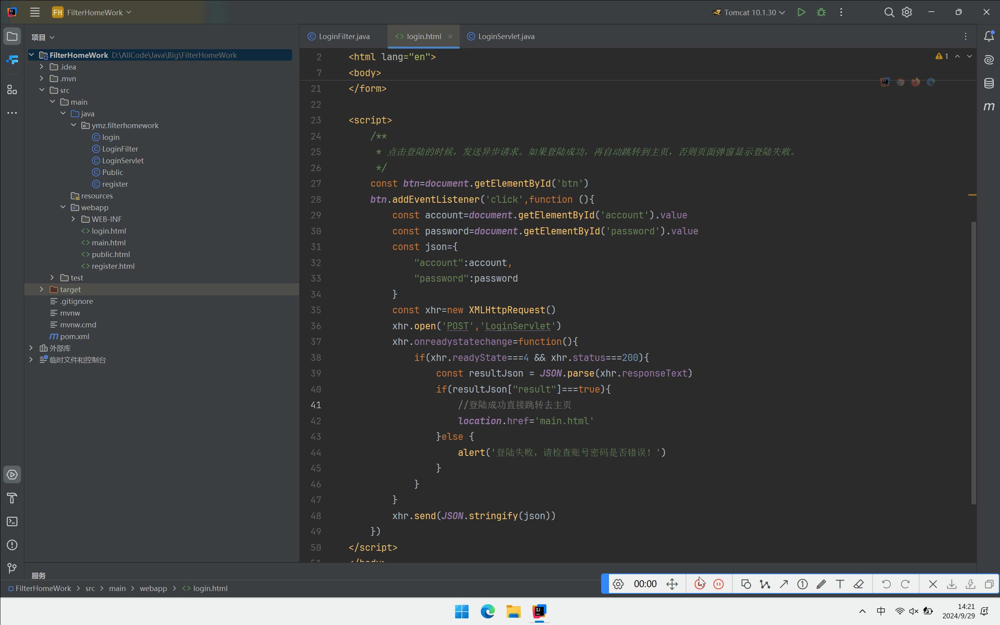
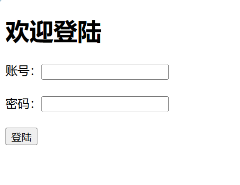

> 软工2203 2200770165 杨明璋


# Filter练习文档

## 总体效果演示




## Filter职责图鉴


## 核心代码解释

### 前端部分



当输入完账号和密码，并点击登陆按钮后，以下这段JavaScript代码将被执行。

```js
//点击登陆的时候，发送异步请求。如果登陆成功，再自动跳转到主页，否则页面弹窗显示登陆失败。

const btn=document.getElementById('btn')
btn.addEventListener('click',function (){
    const account=document.getElementById('account').value
    const password=document.getElementById('password').value
    const json={
        "account":account,
        "password":password
    }
    const xhr=new XMLHttpRequest()
    xhr.open('POST','LoginServlet')
    xhr.onreadystatechange=function(){
        if(xhr.readyState===4 && xhr.status===200){
            const resultJson = JSON.parse(xhr.responseText)
            if(resultJson["result"]===true){
                //登陆成功直接跳转去主页
                location.href='main.html'
            }else {
                alert('登陆失败，请检查账号密码是否错误！')
            }
        }
    }
    xhr.send(JSON.stringify(json))
})
```

这里其实就是手动将表单里的数据封装成为一个json字符串，然后向服务器发送Ajax异步请求。服务器也将返回一个json字符串，其存储了用户是否登陆成功。如果返回的结果是false，页面会弹窗提示用户登陆失败。反之就会通过location对象跳转去主页。

### 后端部分

#### LoginFilter

```java
package ymz.filterhomework;

import jakarta.servlet.*;
import jakarta.servlet.annotation.WebFilter;
import jakarta.servlet.http.HttpServletRequest;
import jakarta.servlet.http.HttpServletResponse;
import java.io.IOException;
import java.util.List;

@WebFilter(urlPatterns = "/*")
public class LoginFilter implements Filter {
    private static final List<String> PASS_URLS = List.of("/login", "/register","/public","/LoginServlet");
    @Override
    public void doFilter(ServletRequest servletRequest, ServletResponse servletResponse, FilterChain filterChain) throws IOException, ServletException {
        //预处理
        HttpServletRequest req = (HttpServletRequest) servletRequest;
        HttpServletResponse resp = (HttpServletResponse) servletResponse;

        //使用req.getServletPath()获取上下文路径后面的访问路径。
        String servletPath = req.getServletPath();
        if(servletPath.equals("/")){
            //特殊情况的处理
            req.getRequestDispatcher("/login").forward(req,resp);
            return;
        }
        if(PASS_URLS.contains(servletPath)){
            //在白名单中，直接放行
            filterChain.doFilter(servletRequest,servletResponse);
            return;
        }
        /**
         * 登陆检验的思路。
         * 在这里使用req.getSession(false);
         * 这里的参数表示是否创建一个新的会话，在找不到的时候。
         * 这里我选择不创建。因为如果请求体中没有JSessionID或者已经失效的话，那么肯定是找不到Session的。
         * 而指定参数值为false的话，就不创建新的Session，而是直接返回null。
         * 于是，我们可以检测此方法返回值是否为非null来判断用户是否登陆。
         */
        if(req.getSession(false)!=null){
            //登陆过
            filterChain.doFilter(servletRequest,servletResponse);
            return;
        }
        //没登录过。直接请求转发到登录页！
        req.getRequestDispatcher("/login").forward(req,resp);
    }
}

```

在Filter中，我设置了一个白名单。对这些资源的访问将被直接放行。而对于其他资源的访问都需要经过登陆检验。

但是我在这里加入了一个额外的东西，就是当我们直接在浏览器输入：`http:/localhost:8080/FilterHomeWork_war_exploded`这串网址时，浏览器也会跳转到登陆页。服务器面对这样的请求，其实会自动去上下文根目录中去找index.jsp或者index.html这些文件。我在Filter中加了个判断，就能引导浏览器强制跳转到登录页。

关于登陆检验，我使用了**req.getSession(false)返回值是否为空**来进行判断，这个方法的含义是从请求对象那里获取Session。此方法的参数的意思是：当找不到Session的时候，是否新建一个Session，这里我选择不创建，那么此方法找不到Session的时候就会返回null。因为如果请求对象的Cookies中没有JSessionID或者已经失效的话，那么肯定是找不到Session的，于是这就能作为用户未登录的标识。

#### LoginServlet

```java
package ymz.filterhomework;

import cn.hutool.json.JSON;
import cn.hutool.json.JSONObject;
import cn.hutool.json.JSONUtil;
import jakarta.servlet.ServletException;
import jakarta.servlet.annotation.WebServlet;
import jakarta.servlet.http.HttpServlet;
import jakarta.servlet.http.HttpServletRequest;
import jakarta.servlet.http.HttpServletResponse;

import java.io.BufferedReader;
import java.io.IOException;
import java.util.Map;

//此Servlet专门处理登陆业务
@WebServlet("/LoginServlet")
public class LoginServlet extends HttpServlet {

    private String account = "ymz";
    private String password = "123456";
    @Override
    protected void doPost(HttpServletRequest req, HttpServletResponse resp) throws ServletException, IOException {
        /**
         * 处理从前端发过来的JSON字符串，将内容使用输入流读取后，再使用Hutool包的JSON工具将其转换为Java中的JSON对象。
         */
        StringBuilder jsonBuilder = new StringBuilder();
        String line;
        try (BufferedReader reader = req.getReader()) {
            while ((line = reader.readLine()) != null) {
                jsonBuilder.append(line);
            }
        }
        String jsonData = jsonBuilder.toString();
        JSONObject jsonObject = JSONUtil.parseObj(jsonData);

        //从JSON对象中获取我们所需的参数
        String account1 = (String) jsonObject.get("account");
        String password1 = (String) jsonObject.get("password");
        JSONObject result = JSONUtil.createObj();

        //校验是否登陆成功
        boolean isLogin = false;
        if(account1.equals(account)&&password1.equals(password)){
            isLogin = true;
            req.getSession(true).setAttribute("account",account1);
        }
        result.putOpt("result",isLogin);
        resp.getWriter().println(result);
    }
}
```

这个Servlet分为两个阶段：

1.**数据处理阶段。**这里使用请求对象中的输入流，将请求报文里的json字符串读入Servlet程序。然后使用Hutool包的JSON工具将其转换成Java可处理的对象。

2.**业务处理阶段。**我们从上一步获得的对象中获得账号、密码，然后和服务器中的进行检验。然后也将结果封装为一个json对象，最后通过响应对象的输出流将这个结果json对象写出去。
