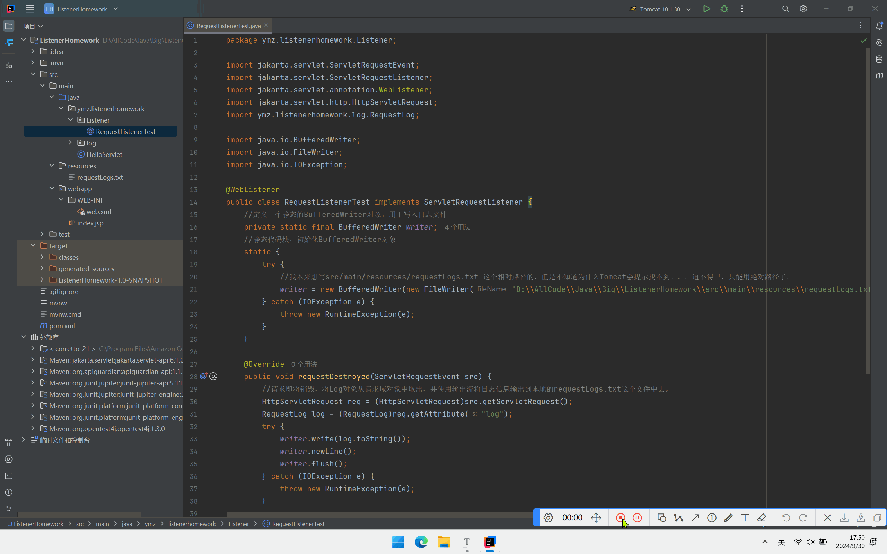

> 软工2203 2200770165 杨明璋


# 思路

1. 实现一个 ServletRequestListener 来**记录每个 HTTP 请求的详细信息**。
2. 记录的信息应包括但不限于：

- 请求时间 （**请求开始时记录当前时间**）
- 客户端 IP 地址 （**getRemoteAddr()**）
- 请求方法（GET, POST 等） （**getMethod()**）
- 请求 URI （**getRequestURI()**）
- 查询字符串 **是指URL中问号后面的那一堆键值对**
- User-Agent  （**getHeader("User-Agent"**)）
- 请求处理时间（从请求开始到结束的时间） **分别在请求创建和销毁的两个监听方法中获取开始时间和结束时间，然后作差。**

1. 在请求开始时记录开始时间，在请求结束时计算处理时间。
2. 使用适当的日志格式，确保日志易于阅读和分析。 **我想用一个RequestLog类来记录以上信息，在请求销毁的最后，使用输出流将日志打印在文件里面。**
3. 实现一个简单的测试 Servlet，用于验证日志记录功能。
4. 提供简要说明，解释你的实现方式和任何需要注意的事项。


# 总体效果：




# 解析

### **ServletRequestListener** 

```java
package ymz.listenerhomework.Listener;

import jakarta.servlet.ServletRequestEvent;
import jakarta.servlet.ServletRequestListener;
import jakarta.servlet.annotation.WebListener;
import jakarta.servlet.http.HttpServletRequest;
import ymz.listenerhomework.log.RequestLog;

import java.io.BufferedWriter;
import java.io.FileWriter;
import java.io.IOException;

@WebListener
public class RequestListenerTest implements ServletRequestListener {
    //定义一个静态的BufferedWriter对象，用于写入日志文件
    private static final BufferedWriter writer;
    //静态代码块，初始化BufferedWriter对象
    static {
        try {
            writer = new BufferedWriter(new FileWriter("D:\\AllCode\\Java\\Big\\ListenerHomework\\src\\main\\resources\\requestLogs.txt"));
        } catch (IOException e) {
            throw new RuntimeException(e);
        }
    }

    @Override
    public void requestDestroyed(ServletRequestEvent sre) {
        //请求即将销毁，将Log对象从请求域对象中取出，并使用输出流将日志信息输出到本地的requestLogs.txt这个文件中去。
        HttpServletRequest req = (HttpServletRequest)sre.getServletRequest();
        RequestLog log = (RequestLog)req.getAttribute("log");
        try {
            writer.write(log.toString());
            writer.newLine();
            writer.flush();
        } catch (IOException e) {
            throw new RuntimeException(e);
        }

    }

    @Override
    public void requestInitialized(ServletRequestEvent sre) {
        //请求开始时，创建Log对象并存入请求域对象中
        HttpServletRequest req = (HttpServletRequest)sre.getServletRequest();
        RequestLog log = new RequestLog(req);
        req.setAttribute("log", log);
    }
}

```

在请求对象刚刚初始化时，我创建一个RequestLog对象（自定义类），然后使用请求对象里的信息来初始化这个对象。然后将这个对象存入请求域中。

在请求即将结束时，先将与之匹配的RequestLog对象从请求域中取出，然后使用输出流将此对象的日志信息输出到本地文件中。


### RequestLog

> 上面的代码看着很简短的原因是，我把很多核心操作都放进这个类里面了。

```java
package ymz.listenerhomework.log;

import jakarta.servlet.http.HttpServletRequest;

import java.text.SimpleDateFormat;
import java.util.Date;

public class RequestLog {
    private long start;
    private long duration;
    private String IPAddress;
    private String requestURL;
    private String requestMethod;
    private String requestParams;
    private String UserAgent;

    public RequestLog(HttpServletRequest req){
        //从请求对象中获取Http请求信息
        start = System.currentTimeMillis();
        IPAddress = req.getRemoteAddr();
        requestURL = req.getRequestURI();
        requestMethod = req.getMethod();
        requestParams = req.getQueryString();
        UserAgent = req.getHeader("User-Agent");
    }

    public void getDuration(){
        //获取请求持续时间
        long end = System.currentTimeMillis();
        duration = end - start;
    }

    @Override
    public String toString() {
        //输出日志时，才计算请求持续时间
        //这里我将日志信息格式化输出
        getDuration();
        Date now = new Date(start);
        SimpleDateFormat sdf = new SimpleDateFormat("yyyy-MM-dd HH:mm:ss");
        String startTime = sdf.format(now);
        return
                "["+startTime+"]"+":"+
                "  IPAddress='" + IPAddress + '\'' +
                ", requestURL='" + requestURL + '\'' +
                ", requestMethod='" + requestMethod + '\'' +
                ", requestParams='" + requestParams + '\'' +
                ", UserAgent='" + UserAgent + '\'' +
                ", duration=" + duration +"ms";
    }
}
```

在这个对象刚开始创建的时候，记录请求的开始时间。然后使用请求对象里的信息来初始化日志对象。

当使用toString()方法输出日志之前，计算请求持续时间，稍稍将开始时间进行格式化后再将日志信息返回。